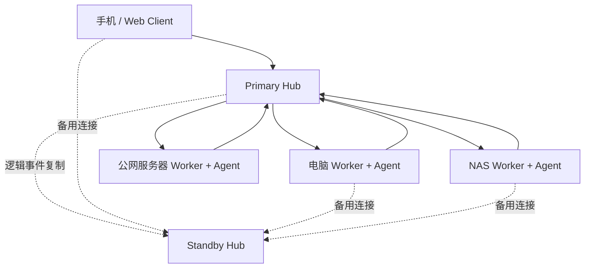

# 万物互联与 Hub 阶段方案

状态：设计阶段，等待本地 Agent 阶段完成

阶段编号：Phase 2 - Device Mesh

前置条件：[本地 Agent 阶段](./local-agent-architecture.md) 完成 Phase 1E 验收

## 1. 阶段目标

本阶段在每台设备已经具备稳定本地 Agent 的基础上，增加设备互联能力：

- 手机、电脑、NAS 或其他公网设备都可以运行 Node Runtime。
- 任意设备可以被配置为 Hub。
- Agent 可以选择目标设备并远程执行任务。
- Hub 可以在设备之间中转消息。
- 文件、日志和其他 Artifact 可以跨设备传输。
- 主 Hub 故障后可以切换备用 Hub。
- 每台设备仍然保留本地 Agent 和本地 SQLite，不依赖中心数据库。

本阶段不是把所有设备变成一个共享文件系统，而是建立“可寻址 Agent 节点 + 可传输资源 + 可恢复任务”的网络。

## 2. 明确不做的事情

第一版不做：

- 完整 Active-Active 多主写入。
- 无冲突全局共享会话。
- Raft 或其他完整共识算法。
- 点对点 NAT 穿透优化。
- 自动同步所有本地文件。
- 将任意设备暴露成无权限的远程 Shell。

第一版采用主备 Hub 和逻辑事件同步。若未来需要强一致自动选主，再单独引入共识层。

## 3. 核心概念

### 3.1 Node

一台设备上的 SuperAgent 运行实例，拥有稳定的 `nodeId` 和密钥对。

Node 负责：

- 运行本地 Agent。
- 提供本地工具和 MCP。
- 主动连接 Hub。
- 接收远程任务。
- 上传和下载 Artifact。
- 保存本地 Session、Run 和事件。

### 3.2 Worker

具备执行能力的 Node，例如电脑、NAS、服务器。Worker 可以执行 coding、文件操作、浏览器或家庭自动化任务。

### 3.3 Hub

负责设备管理和消息路由的 Node。Hub 自身也可以是 Worker。

Hub 负责：

- 设备注册和在线状态。
- Node 路由。
- 消息中转。
- 任务状态和事件同步。
- 会话入口。
- Artifact 临时中转。

### 3.4 Conversation、Run 和 Task

三者必须区分：

```text
Conversation：用户看到的逻辑对话
Task：跨设备的业务目标
Run：某台设备上的一次 Agent 执行
```

一个 Task 可以包含多个 Run：

```text
手机 Conversation
  -> Task: 从电脑取回构建产物
  -> Run 1: 电脑查找文件
  -> Run 2: 电脑上传 Artifact
  -> Run 3: 手机展示和下载
```

## 4. 目标拓扑



所有 Node 主动发起出站连接。Hub 不依赖设备有固定公网 IP，也不要求设备开放入站端口。

## 5. Node Runtime

每台设备新增一个 Node Runtime，位于 Agent Runtime 之上：

```text
Node Runtime
  ├── Identity
  ├── Hub Connection
  ├── Heartbeat
  ├── Message Router
  ├── Remote Task Executor
  ├── Artifact Transfer
  ├── Local Agent Runtime
  └── Local SQLite
```

建议启动方式：

```text
superagent node --mode worker
superagent node --mode hub
superagent node --mode hub-worker
```

大多数设备使用 `hub-worker`，既可以接受远程任务，也可以转发其他设备的消息。

## 6. 设备身份和连接

不再使用数据库中明文保存的远程 `endpoint + apiKey` 作为主要连接方式。

设备第一次加入网络时：

1. 用户在 Hub 上生成一次性 enrollment token。
2. Node 使用 token 完成注册。
3. Node 本地生成或保存自己的密钥对。
4. Hub 保存 Node 公钥和设备元数据。
5. 后续使用短期签名令牌或 mTLS 建立连接。

连接优先使用：

```text
WSS / WebSocket
```

协议需要支持：

- 心跳。
- 断线重连。
- 消息确认。
- 递增序号。
- 幂等处理。
- 最后游标同步。
- 连接到多个候选 Hub。

设备的主连接配置可以是：

```json
{
  "preferredHub": "hub-a",
  "fallbackHubs": ["hub-b", "hub-c"],
  "reconnect": {
    "initialDelayMs": 1000,
    "maxDelayMs": 30000
  }
}
```

## 7. 消息协议

所有节点消息使用统一 Envelope：

```ts
interface NodeEnvelope {
  messageId: string
  type: string
  sourceNodeId: string
  targetNodeId?: string
  hubId?: string
  conversationId?: string
  taskId?: string
  runId?: string
  sequence: number
  createdAt: string
  payload: unknown
}
```

第一版消息类型：

```text
node.hello
node.heartbeat
node.capabilities
node.status
task.start
task.cancel
run.started
run.event
run.completed
run.failed
approval.requested
approval.resolved
artifact.offer
artifact.chunk
artifact.completed
artifact.download
sync.request
sync.response
ack
```

Hub 转发消息时必须保留原始 `sourceNodeId` 和 `messageId`，不能重新生成一个无法关联的消息。

## 8. 远程 Agent 调用

跨设备不使用进程内 `handoff`，而是使用远程任务工具：

```ts
remote_agent_task({
  targetNodeId: "desktop",
  agentProfile: "coding",
  objective: "找到最新的构建产物并上传",
  permissions: ["filesystem.read", "artifact.write"],
  deadlineMs: 300000
})
```

Hub 执行：

```text
创建 Task
  -> 找到目标 Node
  -> 发送 task.start
  -> 接收目标 Node 的 RunEvent
  -> 转发进度和审批请求
  -> 接收结果或 Artifact
  -> 更新 Task 状态
```

远程 Agent 的返回值必须结构化：

```ts
interface RemoteTaskResult {
  taskId: string
  status: "completed" | "failed" | "waiting_approval" | "offline"
  summary?: string
  artifacts: string[]
  childRuns: string[]
  error?: string
}
```

不要让远程 Agent 之间直接发送无限制的自然语言上下文。应传递任务目标、权限、资源引用和结构化结果。

## 9. 文件和资源互联

第一版采用 Hub 中转：

```text
源设备
  -> artifact.offer
  -> Hub 创建临时资源
  -> artifact.chunk 分块上传
  -> artifact.completed
  -> 目标设备下载
```

Artifact 元数据仍然保存到各自 Node 的 SQLite；Hub 只保存中转状态和短期缓存。

资源必须包含：

```text
artifactId
sourceNodeId
targetNodeId
fileName
mimeType
size
sha256
expiresAt
```

传输要求：

- 分块。
- 校验和。
- 断点续传。
- 过期清理。
- 文件权限检查。
- 不把大文件完整塞进模型上下文。

后续可以增加直连传输，但直连失败时必须自动回退到 Hub 中转。

## 10. Hub 路由和中转

Hub 维护：

```text
NodeRegistry
  nodeId
  nodeName
  status
  capabilities
  lastSeen
  connectedHubId

RouteTable
  targetNodeId
  nextHop
  metric
  expiresAt
```

第一版路由规则：

1. 目标 Node 直接连接当前 Hub，直接发送。
2. 目标 Node 通过另一个 Peer Hub 连接，转发给 Peer Hub。
3. 找不到目标时，进入持久化 outbox，等待设备重新上线。
4. 每条转发消息设置 TTL，避免路由环路。

Hub 之间也使用同一套 Node Envelope，不另造一套协议。

## 11. 主备 Hub 和故障切换

第一版采用 Active/Standby：

```text
Hub A：当前主 Hub
Hub B：备用 Hub
```

Node 同时保持两个候选连接，或者在主连接失败后快速连接备用 Hub。

主 Hub 需要向备用 Hub 同步逻辑事件：

```text
hub.event.log
  -> standby sync cursor
  -> standby apply event
```

同步的数据：

- Node 注册信息。
- Node 在线状态。
- Conversation 元数据。
- Task 状态。
- Run 状态。
- 未确认消息。
- Artifact 元数据。

### 11.1 Fencing Token

每次 Hub 成为主节点时生成递增的 `term`：

```text
Hub A term = 10
Hub B term = 11
```

节点拒绝处理低于当前 term 的写入，防止旧 Hub 恢复后继续写入过期状态。

### 11.2 第一版的限制

只有在 Hub 之间仍然可以通信时，自动主备切换才有可靠依据。

如果 Hub A 和 Hub B 完全分区，两者可能同时认为自己是主节点。这种情况称为 split-brain。第一版应采用以下保守策略：

- 默认只允许手动提升备用 Hub。
- 或要求备用 Hub 获得明确的 promotion token。
- 不在没有仲裁的情况下自动执行高风险写操作。

等基础互联稳定后，再考虑 Raft、仲裁节点或外部租约服务。

## 12. 每台设备的 SQLite 设计

每个 Node 都有自己的 SQLite：

```text
node.db
  NodeIdentity
  LocalConversation
  AgentSession
  AgentRun
  RunEvent
  OutboxMessage
  InboxMessage
  Artifact
  HubPeer
  SyncCursor
```

SQLite 负责本地可靠性，Hub 不需要成为所有数据的唯一来源。

需要注意：不能复制正在运行的 SQLite 文件。跨设备同步必须使用逻辑事件、游标和幂等应用。

## 13. 安全边界

远程 coding 必须明确权限：

```text
filesystem.read
filesystem.write
shell.execute
network.fetch
artifact.read
artifact.write
device.control
```

任务发起时携带权限范围，目标 Node 再根据本地策略决定：

- 自动允许。
- 需要用户审批。
- 直接拒绝。

公网 Hub 必须具备：

- Node 身份认证。
- 用户认证。
- 短期令牌。
- 设备撤销。
- 连接限流。
- 消息大小限制。
- 审批审计。
- Artifact 过期清理。

不能因为 Hub 能中转消息，就默认 Hub 能读取所有设备文件内容。

## 14. 实施顺序和阶段门

### Phase 2A：Node Runtime 和单 Hub

前置条件：Phase 1E 完成。

内容：

- Node 身份。
- WebSocket 出站连接。
- 心跳和重连。
- Node 注册。
- Hub 在线列表。
- 一个 Hub 转发任务。

阶段门：电脑作为 Worker 连接 Hub，手机可以选择电脑并发起任务。

### Phase 2B：远程 Run 和审批

内容：

- `task.start`。
- 远程 RunEvent 转发。
- 远程工具审批。
- Task 超时和取消。
- 设备离线状态。

阶段门：手机可以远程让电脑执行 coding 任务，并在手机上完成命令审批。

### Phase 2C：Artifact 文件互联

内容：

- 文件上传。
- 分块传输。
- 校验和。
- 下载。
- 断点续传。

阶段门：手机可以让电脑找到一个文件并安全传回手机。

### Phase 2D：Hub 中转和 Peer Hub

内容：

- Hub 间连接。
- 路由表。
- TTL。
- Outbox。
- 消息确认。

阶段门：设备不直接连接目标设备时，仍然可以通过另一个 Hub 完成任务和文件传输。

### Phase 2E：主备 Hub

内容：

- 备用 Hub。
- 逻辑事件复制。
- Sync Cursor。
- term 和 fencing token。
- 手动或保守的自动切换。

阶段门：主 Hub 停止后，设备可以连接备用 Hub，未完成任务不重复执行，已完成事件不丢失。

### Phase 2F：万物互联验收

必须通过：

1. 手机、电脑和公网服务器注册为 Node。
2. 电脑可以作为 Worker。
3. 公网服务器可以作为 Hub-Worker。
4. 手机可以选择电脑 Agent。
5. Hub 可以转发 Agent 事件和审批请求。
6. 电脑文件可以传回手机。
7. 设备断线后可以重连并补发事件。
8. 主 Hub 停止后可以切换备用 Hub。
9. 重复消息不会重复执行命令或重复上传文件。

只有 Phase 2F 完成，才考虑真正的 Active-Active、Raft、点对点传输和全局任务图。

## 15. 后续扩展

本方案为以下能力预留接口：

- 多 Agent 任务图。
- 设备间 Agent 协商。
- Skill 远程分发。
- MCP 能力目录。
- 本地和远程上下文压缩。
- 点对点文件传输。
- 多 Hub 共识。
- Responses API 适配器。

这些能力都必须建立在稳定的 Node、Task、RunEvent、Artifact 和 Hub 路由之上，不能提前混入本地 Agent 阶段。
