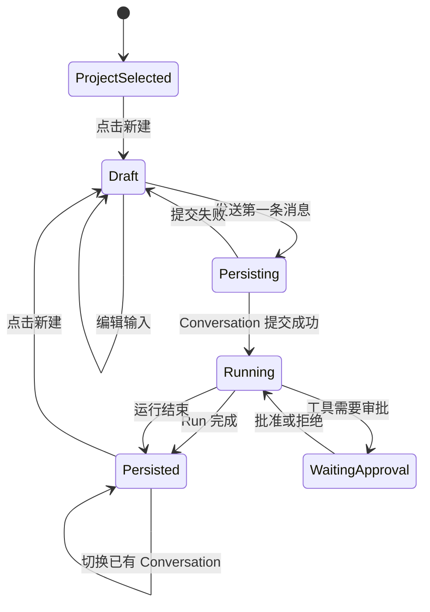
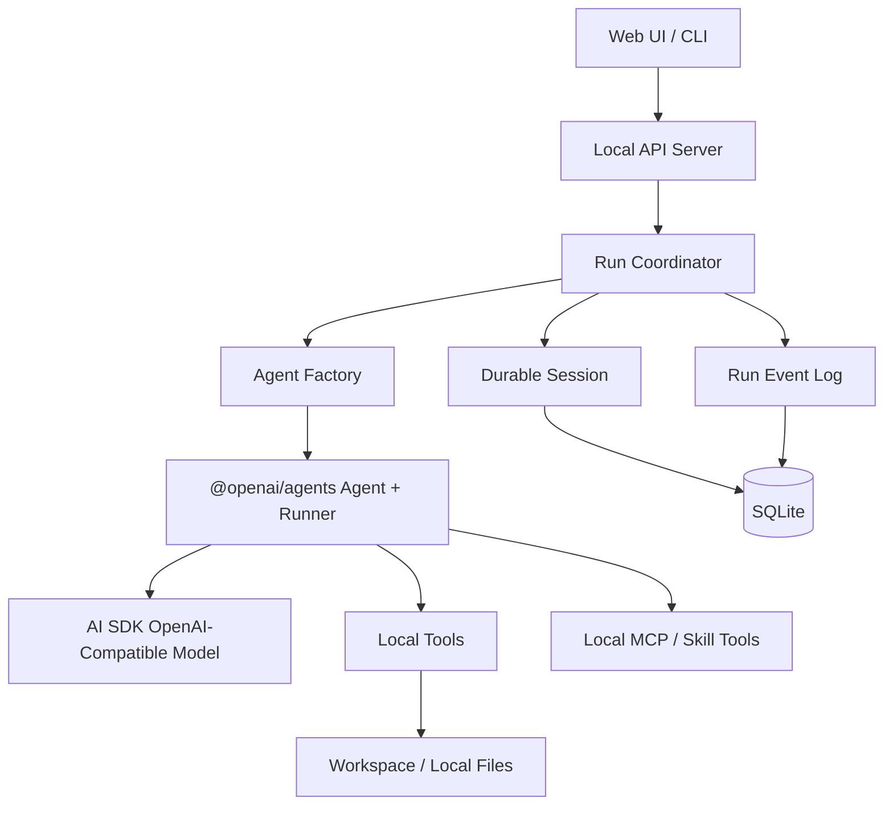

# 本地 Agent 阶段方案

状态：Phase 1A–1B 已实现，Phase 1C–1E 待继续验收

阶段编号：Phase 1 - Local Agent

前置条件：无

后续阶段：[万物互联与 Hub 方案](./device-mesh-architecture.md)

当前代码已经落地 Project / Conversation / Draft、SQLite 持久化 Session、Fastify SSE API、React 工作台和 Chat Completions Agent 基础链路。已验证首条消息原子创建 Conversation、重复 clientMessageId 幂等、跨轮 Session 持久化和应用启动自动初始化 SQLite。

仍待补齐：进程重启后的运行恢复、审批等待恢复、完整 MCP/Skill 装载和停止运行的服务端取消。这些完成前不进入设备互联实现。

## 1. 阶段目标

这一阶段只解决单台设备上的可靠 Agent 使用体验：

- 使用 `@openai/agents` 负责 Agent、Runner、工具调用和流式运行。
- 使用 `@ai-sdk/openai-compatible` 作为默认模型接入方式。
- 支持本地 coding 任务：读取、搜索、修改文件和执行命令。
- 增加基础 `web_fetch` 能力。
- 对话、工具调用、工具结果和运行状态持久化到 SQLite。
- 支持工具审批、运行中断和恢复。
- 为 MCP、Skill、远程设备预留清晰的扩展点，但本阶段不实现设备互联。

本阶段的完成标准是：关闭服务后重新启动，仍然可以继续已有对话；模型可以完成一个完整的 coding 任务；工具调用和审批状态不会因为进程重启而丢失。

## 1.1 产品交互模型：Project、Conversation 和 Draft

本地产品交互采用类似 Codex 桌面端的模型：

```text
Project
  ├── Conversation 1
  ├── Conversation 2
  └── Draft Conversation
```

### Project

Project 是一个本地代码项目或工作区，至少包含：

- `id`。
- 显示名称。
- 本地根目录 `rootPath`。
- 项目级 Agent 配置。
- 项目级模型配置覆盖项。
- 创建和更新时间。

文件工具、Shell 工具和 Skill 都以 Project 的 `rootPath` 作为安全边界，不再使用全局的隐式 workspace。

### Conversation

Conversation 是用户可见的持久化对话。它属于一个 Project，包含：

- 标题。
- 创建和更新时间。
- Agent Profile。
- Agent Session。
- 多次 Agent Run。
- 展示用消息和工具调用时间线。

Conversation 不是一次请求，也不是单个 `run()` 调用。一个 Conversation 可以包含很多轮消息和很多次 Run。

### Draft Conversation

点击“新建”时只创建前端内存对象：

```ts
interface DraftConversation {
  draftId: string
  projectId: string
  title: string
  inputText: string
  createdAt: number
}
```

Draft 不写入服务端 SQLite，也不出现在持久化会话列表中。用户可以输入、切换项目或取消输入而不产生空会话。

只有用户发送第一条非空消息时，才执行一次原子提交：

```text
Draft
  -> 创建 Conversation
  -> 创建 AgentSession
  -> 写入第一条用户输入
  -> 创建 AgentRun
  -> 开始 Agent 运行
```

前端拿到服务端返回的真实 `conversationId` 后，再把 Draft 替换成持久化 Conversation。

如果用户刷新页面，Draft 默认可以丢失；如果希望保留正在输入的文字，可以使用浏览器 localStorage，但仍然不创建服务端会话。

## 1.2 本地页面状态机



关键规则：

- 应用启动时只加载 Project 和已有 Conversation，不自动创建空 Conversation。
- 当前页面始终可以有一个 Draft，但 Draft 没有后端 ID。
- 发送第一条消息的接口必须支持幂等，避免网络重试创建两个 Conversation。
- 新建 Draft 时不调用 `POST /api/conversations`。
- 切换已有 Conversation 时才加载持久化时间线和 Agent Session。

## 2. 明确不做的事情

本阶段不做：

- Responses API。
- `OpenAIResponsesCompactionSession`。
- PostgreSQL、Redis 或云端数据库。
- 多设备连接和 Hub。
- 自动主节点选举。
- Hosted MCP、Tool Search、Programmatic Tool Calling。
- 完整上下文压缩策略。
- 大文件点对点传输。

上下文压缩只预留接口，不作为本阶段验收条件。原因是当前项目优先保证 Chat Completions 兼容模型可以稳定 coding。

## 3. 当前项目需要调整的核心问题

当前项目虽然依赖了 Agents SDK，但 Agent 内核与应用层会话状态耦合较重：

- `packages/agent/src/agent.ts` 负责创建 Agent，但模型、工具、配置和运行状态没有进一步抽象。
- `server/src/modules/chat/turn.service.ts` 仍把 HTTP SSE 生命周期和本轮 Agent 执行绑定在一起，后续需要继续拆出可恢复运行。
- `server/src/modules/approvals/approval.service.ts` 使用内存 Promise 保存审批，进程重启或多请求并发时无法恢复。
- 当前消息模型以普通字符串为主，不足以表示 Agent 的完整输入项。
- `run_command` 是宿主机命令执行能力，必须和明确的工作目录、审批策略以及超时策略绑定。

本阶段的重构方向不是更换模型协议，而是让 Agents SDK 成为运行内核，让 SQLite 成为持久化状态来源。

## 4. 目标本地架构



## 4.1 OpenAI Agents SDK 与应用层的边界

### Agents SDK 负责什么

Agents SDK 是 Agent 执行内核，负责：

- Agent instructions、工具定义和模型调用。
- 多轮工具调用循环。
- 流式输出。
- 工具审批中断。
- `RunState` 或等价的运行恢复信息。
- Agent handoff 和 Agent-as-tool。
- MCP 工具的接入和调用。
- Agent 运行事件的产生。

它不负责产品层的 Project、空白 Draft、Conversation 列表、项目根目录、SQLite 业务表、UI 时间线和本地文件资源管理。

### 我们自己的应用层负责什么

应用层负责：

- Project 的创建、选择和配置。
- Conversation 的生命周期。
- Draft 到 Conversation 的提交。
- SQLite 持久化。
- RunEvent 存储和断点补发。
- 工具权限和本地审批策略。
- Project workspace 安全边界。
- `web_fetch`、文件、Shell 等业务工具。
- MCP/Skill 的注册和本地加载。
- Web UI 状态和消息投影。

Agent 不应该知道“用户点击了新建会话”；它只接收已经提交的 Agent Session 和本轮输入。

推荐的数据流是：

```text
UI Draft
  -> Application API
  -> Project / Conversation / AgentSession 持久化
  -> Run Coordinator
  -> Agents SDK Runner
  -> RunEvent 持久化与 UI 广播
```

### 4.2 组件职责

#### Web UI / CLI

负责输入、流式展示、工具调用展示、审批和文件下载。UI 不直接操作 Agent，也不直接读取 SQLite。

#### Local API Server

负责鉴权、请求校验、会话路由、SSE 或 WebSocket 流式输出，以及将审批操作转成运行恢复请求。

#### Run Coordinator

负责一次 Agent 运行的完整生命周期：

1. 加载会话。
2. 创建或获取 Agent。
3. 启动 `Runner.run`。
4. 持久化流式事件。
5. 处理审批中断。
6. 保存最终运行状态。
7. 将事件发送给 UI。

#### Agent Factory

根据 Agent Profile 创建 Agent。它不应该读取 HTTP 请求，也不应该直接操作数据库。

建议支持以下 Profile：

- `coding`：文件、搜索、命令、补丁。
- `research`：`web_fetch`、网页内容提取。
- `general`：基础对话和本地工具。

Profile 由 instructions、模型配置、工具集合、审批策略组成。

## 5. 模型接入策略

本阶段只使用 Chat Completions 兼容模型：

```text
@openai/agents
    + @openai/agents-extensions/ai-sdk
    + @ai-sdk/openai-compatible
```

保留 Ollama、vLLM、LM Studio、DeepSeek、通义和其他兼容服务的接入能力。

模型创建必须集中在 `ModelFactory`，不要让业务层到处直接构造 provider：

```ts
interface ModelProfile {
  name: string
  baseURL: string
  apiKey: string
  model: string
  contextWindow?: number
}

function createModel(profile: ModelProfile) {
  // 使用 @ai-sdk/openai-compatible 创建 Chat Completions 模型
}
```

本阶段不为 Responses API 设计分支，但 `ModelProfile` 不要和具体 SDK 类型绑定，后续可以增加第二种传输协议。

## 6. 会话持久化设计

不能只保存如下形式的消息：

```text
role + content
```

应该保存 Agent 输入项的完整 JSON。这样工具调用、工具返回值和多轮恢复才不会丢失。

建议的 SQLite 表：

```text
Project
  id
  name
  rootPath
  settingsJson
  createdAt
  updatedAt

Conversation
  id
  projectId
  title
  status
  agentProfile
  createdAt
  updatedAt

AgentSession
  id
  conversationId
  sessionKey
  status
  createdAt
  updatedAt

SessionItem
  id
  sessionId
  sequence
  itemType
  payloadJson
  createdAt

AgentRun
  id
  sessionId
  status
  inputJson
  finalOutputJson
  stateJson
  error
  startedAt
  finishedAt

RunEvent
  id
  runId
  sequence
  eventType
  payloadJson
  createdAt

Approval
  id
  runId
  toolCallId
  toolName
  argumentsJson
  status
  decision
  createdAt
  resolvedAt

Artifact
  id
  runId
  fileName
  mimeType
  size
  sha256
  localPath
  status
  createdAt
```

SQLite 使用 WAL 模式。数据库只保存结构化状态和资源元数据，大文件保存到应用数据目录，例如：

```text
.cloudagent/
  .data/data.db
  artifacts/
  logs/
  skills/
```

### 6.1 Session 接口

实现一个应用自己的持久化 Session，封装 SQLite：

```ts
interface DurableSession {
  getItems(): Promise<AgentInputItem[]>
  addItems(items: AgentInputItem[]): Promise<void>
  popItem(): Promise<AgentInputItem | undefined>
  clear(): Promise<void>
  replaceItems(items: AgentInputItem[]): Promise<void>
}
```

Agent 运行时只依赖这个接口，不直接依赖 Prisma。

## 6.2 API 设计

建议不要继续使用“先创建 Session、再调用 `/sessions/:id/chat`”的流程。它会天然产生大量空会话。

推荐接口：

```text
GET  /api/projects
POST /api/projects
GET  /api/projects/:projectId/conversations
GET  /api/conversations/:conversationId
GET  /api/conversations/:conversationId/timeline
POST /api/projects/:projectId/turns
POST /api/conversations/:conversationId/turns
```

其中：

- `POST /api/projects/:projectId/turns` 用于 Draft 的第一条消息。
- 服务端在一个事务中创建 Conversation、AgentSession、第一条输入和 AgentRun。
- 请求携带 `clientMessageId`，用于防止网络重试造成重复会话。
- `POST /api/conversations/:conversationId/turns` 用于已有 Conversation 的后续消息。

Draft 不需要后端 API。前端可以使用：

```ts
type ActiveConversation =
  | { kind: 'draft'; draftId: string; projectId: string }
  | { kind: 'persisted'; conversationId: string; projectId: string }
```

当 Draft 首次发送成功时，客户端将 `kind: 'draft'` 替换为 `kind: 'persisted'`，并继续使用服务端返回的 `conversationId` 接收事件。

### 6.3 运行恢复

审批或服务中断时，必须保存：

- `runId`。
- Agent Session ID。
- 工具调用 ID。
- 工具参数。
- 当前审批状态。
- 可恢复的运行状态或等价重试信息。

恢复请求应当是幂等的。用户重复点击批准时，不能重复执行命令。

## 7. 本地工具设计

### 7.1 Coding 工具

保留现有工具，但统一实现工具上下文：

```ts
interface ToolContext {
  workspace: string
  sessionId: string
  runId: string
  signal?: AbortSignal
}
```

文件工具必须：

- 只允许访问配置的 workspace。
- 统一处理 Windows 路径。
- 限制单次读取大小。
- 对二进制文件返回元数据，而不是直接塞入上下文。

`run_command` 必须：

- 明确绑定 workspace。
- 默认需要审批。
- 支持超时和取消。
- 限制输出长度。
- 记录完整命令、退出码和输出摘要。

不能在请求处理过程中通过修改环境变量来改变审批策略。

### 7.2 `web_fetch`

基础版本只做网页文本获取：

```ts
web_fetch({
  url: string,
  maxBytes?: number,
  timeoutMs?: number,
})
```

要求：

- 只允许 `http` 和 `https`。
- 限制响应大小，默认不超过 1 MB。
- 限制请求超时。
- 返回标题、最终 URL、内容类型和正文。
- 对 HTML 做基础正文提取。
- 不默认访问 localhost、内网 IP 和本机管理端口。
- 后续再增加下载二进制文件的能力。

### 7.3 MCP 和 Skill 预留

本阶段可以接入本机 MCP，但只要求能够作为普通工具运行。优先支持：

- stdio MCP。
- Streamable HTTP MCP。

Skill 先采用本地目录方式：

```text
.cloudagent/skills/<skill-id>/
  SKILL.md
  manifest.json
  references/
  scripts/
```

Skill Loader 负责读取 manifest、注入 instructions、挂载工具和校验权限。暂时不做远程分发。

## 8. 事件流设计

UI 看到的内容不应只来自内存中的 `for await` 循环，而应先写入 `RunEvent`，再广播给客户端。

事件至少包括：

```text
run.started
run.status
message.delta
reasoning.delta
tool.called
tool.approval_requested
tool.approved
tool.denied
tool.output
artifact.created
run.completed
run.failed
```

每个事件有递增 sequence。客户端断线重连时携带最后一个 sequence，服务端从 SQLite 补发遗漏事件。

## 9. 实施顺序和阶段门

### Phase 1A：运行内核整理

内容：

- 集中模型创建。
- Agent Factory。
- Run Coordinator。
- 保留当前 Chat Completions 模型路径。
- 移除请求级别修改环境变量的行为。

阶段门：单轮 coding 任务可以正常完成，审批策略不被请求覆盖。

### Phase 1B：SQLite Session

内容：

- 新建 Conversation、AgentSession、SessionItem、AgentRun、RunEvent。
- 用 DurableSession 替换手动拼接历史。
- 保存完整工具调用项。

阶段门：重启服务后可以继续已有对话，并且历史工具调用不破坏下一轮运行。

### Phase 1C：可靠审批和事件流

内容：

- Approval 持久化。
- 中断恢复。
- sequence 和断点续传。
- UI 根据事件重建运行状态。

阶段门：审批过程中重启服务后，状态可恢复；客户端断线后可以补事件。

### Phase 1D：web_fetch、Artifact 和 Skill 预留

内容：

- `web_fetch`。
- 本地 Artifact 目录。
- Skill Loader。
- 本地 MCP 接入。

阶段门：Agent 能完成“查资料、修改代码、运行测试、返回文件”的本地任务。

### Phase 1E：本地验收

必须通过：

1. 创建会话并执行 coding 任务。
2. Agent 读取并修改文件。
3. Agent 执行测试命令并需要审批。
4. 重启服务后继续对话。
5. 工具调用和工具结果完整显示。
6. `web_fetch` 获取网页内容。
7. 生成或读取 Artifact。
8. 客户端断线后可以恢复事件。

只有 Phase 1E 完成，才进入万物互联阶段。

## 10. 官方 SDK 依据

本方案以 Agents SDK 的 Agent、Runner、Session、工具和 MCP 能力为基础。会话文档说明了自定义 Session、会话历史管理和可恢复运行的扩展方式：

- [Agents SDK Quickstart](https://openai.github.io/openai-agents-js/zh/guides/quickstart/)
- [Sessions](https://openai.github.io/openai-agents-js/zh/guides/sessions/)
- [Tools](https://openai.github.io/openai-agents-js/zh/guides/tools/)
- [MCP](https://openai.github.io/openai-agents-js/zh/guides/mcp/)

本阶段明确不依赖 Responses 专属能力；上下文压缩、远程 Hub 和跨设备协作留到后续阶段。
